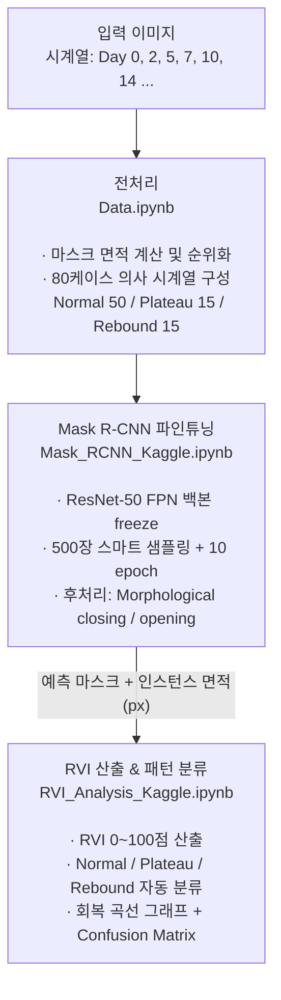

# Wound Recovery Analysis

**Mask R-CNN 기반 피부 상처 인스턴스 세그멘테이션 및 회복 추적 시스템**

상처 이미지 시계열을 입력받아 상처 영역을 인스턴스 단위로 자동 분할하고,
회복 속도 지수(RVI)와 치료 반응 패턴(Normal / Plateau / Rebound)을 산출하는 CV 파이프라인.

---

## 왜 Mask R-CNN인가

의료 이미지 세그멘테이션의 사실상 표준은 U-Net이지만, 이 프로젝트의 핵심 목적은 **상처 인스턴스 단위 추적**이다.

| 상황 | U-Net (Semantic) | Mask R-CNN (Instance) |
|------|------------------|-----------------------|
| 상처 1개 | 정상 동작 | 정상 동작 |
| 상처 2개+ | 하나의 덩어리로 합산 | 각 상처를 개별 인스턴스로 분리 |
| 인스턴스별 RVI | 불가능 | **상처 A / B 각각 독립 산출** |

당뇨발, 화상, 욕창 환자는 한 이미지에 여러 상처가 동시에 존재한다.
U-Net은 이 경우 상처별 독립 추적이 **구조적으로 불가능**하다.
Mask R-CNN은 각 상처에 고유 인스턴스 ID를 부여해 개별 회복 경과를 추적할 수 있다.

> 실제 테스트셋 100장 중 **37장(37%)에서 2개 이상 인스턴스 자동 분리** 확인

---

## 파이프라인



---

## 성능 결과

### 세그멘테이션 (테스트셋 100장)

| 지표 | 로컬 1 epoch | Kaggle 10 epoch | 개선 |
|------|-------------|-----------------|------|
| Mean IoU | 0.428 | **0.550** | +28% |
| Mean Dice | 0.520 | **0.662** | +27% |
| Recall | 0.790 | **0.872** | +10% |
| 면적 상대 오차 | 24.1× | **2.65×** | 9배 개선 |

### 패턴 분류 (80 케이스, 룰 기반)

| 패턴 | 케이스 | 정확도 | 평균 RVI | 평균 안정화일 |
|------|--------|--------|----------|--------------|
| Normal | 50 | **100%** | 69.9 | Day 18 |
| Plateau | 15 | 60% | 46.4 | Day 12 |
| Rebound | 15 | **100%** | 60.4 | Day 18 |
| **전체** | **80** | **92.5%** | — | — |

---

## 핵심 구현

### RVI (Recovery Velocity Index)

$$\text{RVI} = \text{clip}\left(\frac{A_0 - A_{\text{last}}}{A_0} \times \frac{14}{T_{\text{last}}} \times 100,\; 0,\; 100\right)$$

- $A_0$: Day 0 상처 면적 (px), $A_{\text{last}}$: 최종 측정 면적 (px)
- 14일 기준 정규화 — RVI 100 = 2주 내 완전 회복

### 패턴 분류 규칙

| 패턴 | 판별 조건 |
|------|-----------|
| Rebound | 중간 구간(Day 3~15)에서 면적이 5% 이상 증가한 타임포인트 존재 |
| Plateau | 후반 3구간(Day 9→18) 변화율이 모두 10% 미만 |
| Normal | 위 두 조건 미해당 |

### 학습 전략

- **Backbone Freeze**: ResNet-50 FPN 백본 고정, RPN + Detection Head만 파인튜닝 (과적합 방지)
- **스마트 샘플링**: 마스크 면적 기준 small / mid / large 균등 500장 선택 (클래스 불균형 완화)
- **후처리**: Morphological closing(7×7) → opening(3×3) → 소형 컴포넌트 제거

---

## 프로젝트 구조

```
wound-recovery/
├── Data.ipynb                         # 데이터 전처리 + 의사 시계열 생성
├── Mask_RCNN_Kaggle.ipynb             # 모델 학습 및 추론 (Kaggle T4)
├── RVI_Analysis_Kaggle.ipynb          # RVI 산출 + 패턴 분류 + 시각화
├── app.py                             # 데모 애플리케이션
├── mask_rcnn_wound_final.pth          # 학습된 모델 가중치
│
└── data_wound_seg/
    ├── train_images/                  # 학습 이미지 2,197장
    ├── train_masks/                   # 학습 마스크 2,197장
    ├── test_images/                   # 테스트 이미지 539장
    ├── test_masks/                    # 테스트 마스크 539장
    └── cases/                         # 80개 의사 시계열 케이스
        ├── normal_000/ ~ normal_049/  # Normal 패턴 (50개)
        ├── plateau_000/ ~ plateau_014/# Plateau 패턴 (15개)
        └── rebound_000/ ~ rebound_014/# Rebound 패턴 (15개)
```

---

## 실행 방법

### 환경 설정

```bash
pip install torch torchvision opencv-python numpy pandas matplotlib scikit-learn scipy
```

### Step 1 — 데이터 전처리 (로컬)

`Data.ipynb` 실행
- 마스크 면적 순위 CSV 생성 (`mask_area_rank_train.csv`, `mask_area_rank_test.csv`)
- 80개 의사 시계열 케이스 생성 (`cases/` 폴더)

### Step 2 — 모델 학습 & 추론 (Kaggle T4 권장)

`Mask_RCNN_Kaggle.ipynb` 실행
- Cell 1 Config에서 경로 확인 후 Run All
- 학습: 500장 스마트 샘플링, 10 epoch, backbone freeze
- 추론: 테스트셋 100장, IoU / Dice / Recall / 면적 오차 평가
- 출력: `mask_rcnn_wound.pth`, 추론 결과 이미지

### Step 3 — RVI 분석 (Kaggle)

`RVI_Analysis_Kaggle.ipynb` 실행
- 시계열 면적 추출 → RVI 산출 (0~100점) → 패턴 분류
- 출력: 회복 곡선 그래프, RVI 분포 박스플롯, Confusion Matrix

---

## 데이터셋

- **출처**: wsnet, medetec, fusc 데이터셋 병합
- **규모**: train 2,197장 / test 539장 (이미지 + 바이너리 마스크)
- **의사 시계열 구성**: GT 마스크 면적 기반 greedy 매칭

  | 패턴 | 면적 감소 비율 시퀀스 |
  |------|----------------------|
  | Normal | `[1.00, 0.75, 0.55, 0.40, 0.28, 0.18, 0.10]` |
  | Plateau | `[1.00, 0.78, 0.60, 0.45, 0.44, 0.44, 0.40]` |
  | Rebound | `[1.00, 0.78, 0.60, 0.48, 0.52, 0.35, 0.22]` |

> **한계**: 동일 환자의 연속 촬영이 아닌 의사(pseudo) 시계열이므로 임상적 의미는 제한적.
> 이 프로젝트의 목적은 실용 의료 AI가 아닌, **CV 파이프라인 전체(전처리 → 학습 → 추론 → 평가 → 분석)를 직접 완주한 경험** 확보에 있다.

---

## 향후 개선 방향 — 모델 성능 향상

현재 Mean IoU 0.550 기준으로, 아래 방향으로 성능을 단계적으로 높일 수 있다.

### 1. 학습 데이터 확장

| 항목 | 현재 | 개선 방향 |
|------|------|-----------|
| 학습 이미지 수 | 500장 (스마트 샘플링) | 전체 2,197장 사용 |
| 학습 epoch | 10 | 20~30 (Early Stopping 적용) |
| 예상 효과 | — | IoU +0.05~0.10 수준 |

### 2. 데이터 증강 (Albumentations)

소규모 데이터셋에서 과적합을 줄이는 가장 효과적인 방법.

```python
import albumentations as A

transform = A.Compose([
    A.HorizontalFlip(p=0.5),
    A.RandomBrightnessContrast(p=0.3),   # 조명 변화 대응
    A.GaussNoise(p=0.2),                 # 센서 노이즈 모사
    A.ElasticTransform(p=0.2),           # 상처 형태 변형
    A.CLAHE(p=0.3),                      # 저대비 이미지 보정
], bbox_params=A.BboxParams(format='pascal_voc'),
   additional_targets={'mask': 'mask'})
```

### 3. Anchor 크기 튜닝 (소형 상처 대응)

현재 기본 anchor는 소형 상처(16px 이하)를 검출하기 어렵다.

```python
# torchvision AnchorGenerator 커스터마이징
from torchvision.models.detection.rpn import AnchorGenerator

anchor_generator = AnchorGenerator(
    sizes=((8, 16, 32, 64, 128),),       # 기본값: (32, 64, 128, 256, 512)
    aspect_ratios=((0.5, 1.0, 2.0),) * 5
)
```

### 4. 백본 업그레이드

| 백본 | 파라미터 | 예상 IoU | 비고 |
|------|----------|----------|------|
| ResNet-50 FPN (현재) | 44M | 0.550 | 기본 |
| ResNet-101 FPN | 63M | +0.03~0.05 | Kaggle T4 학습 가능 |
| ConvNeXt-Base FPN | 89M | +0.05~0.08 | 최신 CNN 계열 |
| Swin-T FPN | 48M | +0.05~0.10 | Transformer 기반 |

### 5. 손실 함수 개선

현재 torchvision 기본 손실(Cross-Entropy + Smooth L1)에서 개선 가능.

```python
# Dice Loss + Focal Loss 조합 — 클래스 불균형 및 경계 정확도 향상
loss = dice_loss(pred_mask, gt_mask) + focal_loss(pred_mask, gt_mask)
```

- **Focal Loss**: 쉬운 배경 픽셀 loss 비중 낮추고 어려운 상처 경계에 집중
- **Dice Loss**: IoU와 직접 연관된 지표를 loss로 사용해 평가 지표와 목적 일치

### 6. 후처리 고도화

```python
# 현재: Morphological 연산 + 소형 컴포넌트 제거
# 개선: CRF(Conditional Random Field)로 경계 정밀도 향상
import pydensecrf.densecrf as dcrf
# → 상처 경계부 IoU 집중 개선 효과
```

### 7. 실제 시계열 데이터 확보 (장기 과제)

현재 의사(pseudo) 시계열의 근본적 한계를 해결하려면 동일 환자의 연속 촬영 데이터가 필요하다.
- 공개 데이터셋: Medetec Wound Database, DFUC2021(당뇨발 궤양)
- 실제 시계열 도입 시 RVI / 패턴 분류의 임상적 유효성 검증 가능

---

## 기술 스택

| 분류 | 기술 |
|------|------|
| 세그멘테이션 | Mask R-CNN (torchvision, ResNet-50 FPN) |
| 딥러닝 프레임워크 | PyTorch |
| 데이터 처리 | NumPy, OpenCV, Pillow |
| 분석 / 시각화 | Pandas, Matplotlib, scikit-learn, SciPy |
| 실험 환경 | Kaggle (T4 GPU) |
